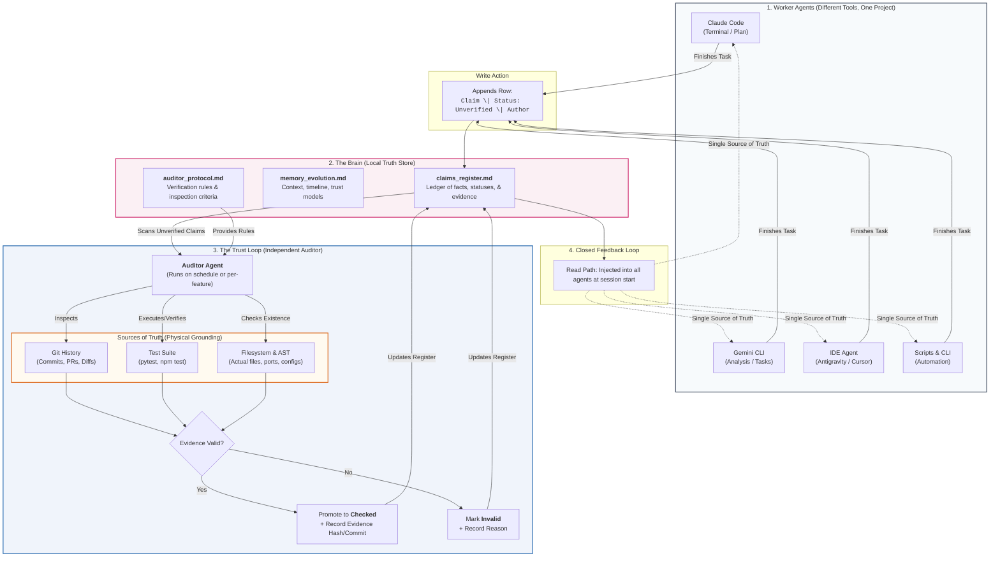
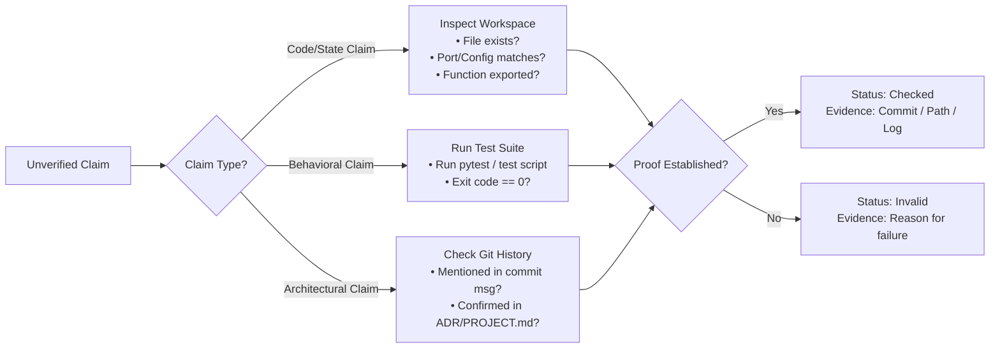

# 🏛️ Ghostkeep Architecture v2: Verifiable Memory & Claims Engine

**Status:** Architecture Blueprint & Change Specification  
**Author:** Ghost (Akshu Grewal)  
**Date:** October 2026  
**Core Thesis:** *Memory is not a fuzzy summary of the past. Memory is a verified Claims Register where the Writer and the Checker are strictly decoupled.*

---

## 1. Executive Summary & Why We Are Changing

In our initial concept and Phase 0 spike:
* We assumed raw terminal/IDE events could simply be recorded via hooks and summarized.
* **What broke:** Antigravity and Gemini CLI lack native command hooks (only Cursor and Claude Code reliably provide them). More critically, relying on LLMs to self-summarize their own sessions creates **self-certification**—an agent that hallucinates code will happily certify that the code works.

### The Paradigm Shift (Post-Baton Consultation)
1. **From Fuzzy Summaries to Discrete Claims:** We no longer store vague conversational narratives. We store atomic, falsifiable claims in a structured tabular register.
2. **Decoupled Roles (The Golden Rule):**
   * **Worker Agents (Claude Code, Gemini CLI, IDE, Antigravity):** Only propose claims (`Status: Unverified`).
   * **Auditor Agent:** An independent verification engine that tests claims against physical sources of truth (Git AST, file hashes, test suites, API responses) before promoting them to `Checked` or flagging them as `Invalid`.
3. **No Automatic Deletion, Only Epistemic Debt:** Code written 6 months ago isn't wrong because it's old (`Old ≠ Wrong`). Instead, unverified claims that linger beyond 30 days are flagged as debt.

---

## 2. What Needs to Change (Delta Matrix)

| Component | Current State (Phase 0) | Target State (Architecture v2) | Action Required |
|---|---|---|---|
| **Memory Storage** | Raw `events.jsonl` append log | Structured `brain/claims_register.md` + ledger backing | Add claims table schema & parser |
| **Agent Write Path** | Passive hooks only (`hook.py` on port 8765) | **Dual-Track Capture:** 1. Explicit `AGENTS.md` worker contract. 2. Auditor scans `git log -p` for unwritten diffs. | Create universal `AGENTS.md` contract |
| **Verification Logic** | None (everything trusted) | Independent `Auditor Agent` (`auditor.py`) following `auditor_protocol.md` | Build automated Auditor CLI / script |
| **Memory Read Path** | Manual file reading | Single source of truth read at session start (`brain/claims_register.md` / `MEMORY.md`) | Standardize startup injection prompt / MCP tool |
| **Conflict Handling** | Not specified | Status-based resolution (`Checked` always beats `Unverified`; conflicting `Checked` triggers Human Review) | Implement conflict detection in Auditor |

---

## 3. High-Level Architecture Diagram

---

## 4. Detailed Component Specifications

### 4.1 The Dual-Track Capture Engine
To solve the **"Automatic Capture Paradox"** (agents forgetting to write, or tools without hooks):

1. **Track A (Active - Worker Contract):**
   * Placed in `AGENTS.md` (and mirrored in `.cursorrules`, `GEMINI.md`, `CLAUDE.md`).
   * Rule: *"Whenever you complete a feature, refactor code, or change a configuration, append an `Unverified` claim to `brain/claims_register.md`."*
2. **Track B (Passive - Auditor Git Scanner):**
   * When the Auditor runs, it performs a `git diff` against the last audited commit.
   * If significant architectural files were modified but no corresponding claim was logged, the Auditor creates an entry:
     `C-XXX | Modified database schema to add table Y | Unverified | auto-detected from commit abc123 | System`

### 4.2 How the Auditor Decides (Verification Logic)
The Auditor classifies claims into three distinct categories:

1. **Code Existence / State Claims** (e.g., *"FastAPI capture daemon runs on port 8765"*):
   * **Verification:** Read `phase0/server.py`, inspect port argument, or query socket.
2. **Behavioral Claims** (e.g., *"All unit tests pass for claims parser"*):
   * **Verification:** Execute the actual test runner (`python -m unittest` or `pytest`) and check return code.
3. **Architectural / Policy Claims** (e.g., *"We chose SQLite over PostgreSQL for local storage"*):
   * **Verification:** Check git commit logs, `PROJECT.md`, or previous checked entries.

### 4.3 Conflict Resolution Rules
When two agents produce contradictory statements:
* **`Checked` vs `Unverified`:** The `Checked` claim always wins. The `Unverified` claim is flagged as `Invalid (Contradicts C-XXX)`.
* **`Checked` vs `Checked`:** Both claims were verified at different times (e.g., someone changed the database engine). The newer commit hash supersedes the older one; the old record is updated with `Status: Superseded (by C-YYY)`.
* **Zero silent deletion:** No row is ever deleted automatically.

---

## 5. Implementation Roadmap (What We Will Build)

1. **Phase 1: Worker Integration & Universal Rules**
   * Standardize the Claim Schema in [`brain/claims_register.md`](file:///e:/Ghost%20OS/projects/ghostkeep/brain/claims_register.md).
   * Create the unified [`AGENTS.md`](file:///e:/Ghost%20OS/projects/ghostkeep/AGENTS.md) contract for all tools.
2. **Phase 2: The Automated Auditor (`auditor.py`)**
   * Build a lightweight Python verification script.
   * Capable of parsing Markdown tables, verifying file presence/test results, and rewriting the Markdown status in-place.
3. **Phase 3: Automated Audit Loop & Git Pre-Push Hook**
   * Run the auditor as a scheduled task or git pre-commit/pre-push check.
4. **Phase 4: Multi-Agent Read Sync**
   * Expose a generated `brain/MEMORY.md` (or MCP server) providing only `Checked` claims to incoming sessions.
