# Ghostkeep Brain 🧠

Welcome to the **Ghostkeep Knowledge Base & Obsidian Brain**. This vault contains all conceptual frameworks, architectural specifications, design decisions, comparison studies, research articles, and future ideas powering Ghostkeep.

---

## 🗺️ Map of Content (MOC)

```mermaid
graph TD
    Index["Ghostkeep Brain (Index)"] --> Guide["📖 Engineering Manual"]
    Index --> Specs["🎯 Specs & Problems"]
    Index --> Concepts["💡 Concepts"]
    Index --> Architecture["🏛️ Architecture"]
    Index --> Comparisons["⚖️ Comparisons"]
    Index --> Ideas["🚀 Ideas & Roadmap"]
    Index --> Articles["📄 Articles & Research"]

    Guide --> G1["[[01-system-overview-and-purpose|1. Overview & Purpose]]"]
    Guide --> G2["[[02-component-deep-dive|2. Component Deep Dive]]"]
    Guide --> G3["[[03-io-contracts-and-schemas|3. I/O Contracts & Schemas]]"]
    Guide --> G4["[[04-developer-workflow-and-setup|4. Workflow & Setup]]"]

    Specs --> Sync["[[cross-surface-agent-sync|Cross-Surface Sync (Terminal vs IDE)]]"]
    Concepts --> Prov["[[provenance-tracking|Provenance Tracking]]"]
    Concepts --> VecLess["[[vectorless-memory|Vectorless Memory]]"]
    Concepts --> Conf["[[conflict-detection-and-resolution|Conflict Resolution]]"]
    Concepts --> MCP["[[mcp-memory-protocol|MCP Memory Protocol]]"]
    Concepts --> Jev["[[jev-system-one-decisions|Jev & System One Decisions]]"]

    Architecture --> Storage["[[storage-engine|Storage Engine]]"]
    Architecture --> Lifecycle["[[lifecycle-of-a-fact|Lifecycle of a Fact]]"]
    Architecture --> Sieve["[[jev-powered-ambient-sieve|Jev-Powered Ambient Sieve]]"]

    Comparisons --> VsTrad["[[ghostkeep-vs-traditional-memory|Ghostkeep vs Traditional Memory]]"]
    Comparisons --> Dream["[[ghostkeep-and-dreamkeeper|Ghostkeep & DreamKeeper]]"]
    Comparisons --> Graphiti["[[graphiti-vs-mem0-vs-ghostkeep|Graphiti vs Mem0 vs Ghostkeep]]"]

    Ideas --> Roadmap["[[future-roadmap|Future Roadmap & Ideas]]"]
    Ideas --> LongMemOpt["[[longmemeval-optimizations-for-ghostkeep|LongMemEval Memory Optimizations]]"]
    Articles --> Research["[[provenance-in-agentic-systems|Provenance in Agentic Systems]]"]
```

---

## 📚 Vault Navigation

### 📖 Complete Project Manual & Codebase Guide
- **[[01-system-overview-and-purpose]]**: Why Ghostkeep exists, solving cross-surface agent amnesia, and the 3-Tier memory sieve model.
- **[[02-component-deep-dive]]**: Module-by-module breakdown of `store.py`, `sieve.py`, `scribe.py`, `server.py`, and `cli.py`.
- **[[03-io-contracts-and-schemas]]**: Exact JSON storage schemas, Sieve signatures, real terminal outputs, and MCP JSON-RPC payloads.
- **[[04-developer-workflow-and-setup]]**: Setup runbook, Claude Desktop / Cursor MCP configs, testing guide, and troubleshooting.

### 🎯 Flagship Problem & Specifications
- **[[cross-surface-agent-sync]]**: Solving the **Terminal CLI (`agy`) vs IDE Agent Amnesia**. When you use the same account on the same repo, but the terminal agent and the IDE agent have no awareness of each other. How Ghostkeep acts as the shared brain & real-time provenance bus.

### 1. 💡 Core Concepts
- [[provenance-tracking]]: Why provenance is the missing dimension in agent memory. W3C PROV lineage, session IDs, and derivation ancestry.
- [[vectorless-memory]]: Why plain JSON and file-backed stores outperform opaque vector databases for ground truth and explainability.
- [[conflict-detection-and-resolution]]: Zero silent overwrites. How contradictions across multi-agent sessions are detected, staged, and resolved.
- [[mcp-memory-protocol]]: Unifying cross-client agent memory across Claude Desktop, Cursor, Windsurf, Claude Code, and Gemini CLI.
- [[jev-system-one-decisions]]: How TypeSafe's Jev model introduces non-autoregressive, RLCD-calibrated micro-decisions to agent memory.

### 2. 🏛️ Architecture & Internals
- [[storage-engine]]: Anatomy of `facts.json`, `conflicts.json`, and the append-only `provenance.jsonl` audit ledger.
- [[lifecycle-of-a-fact]]: From creation (`add_memory`), conflict detection, and search retrieval, to resolution and supersession.
- [[jev-powered-ambient-sieve]]: Upgrading `store.py` with 70ms semantic conflict detection and filtering out 95% of transcript noise.

### 3. ⚖️ Comparisons & Ecosystem
- [[ghostkeep-vs-traditional-memory]]: Direct comparison with Mem0, Supermemory, Echo, and native vendor memory.
- [[ghostkeep-and-dreamkeeper]]: How Ghostkeep acts as the canonical source-of-truth while DreamKeeper performs background consolidation ("dreaming").
- [[graphiti-vs-mem0-vs-ghostkeep]]: Deep teardown of Graphiti's 4-stage `add_episode` pipeline, Mem0's entity-linking trade-offs, write amplification costs, and LOCOMO benchmark vulnerabilities.

### 4. 🚀 Research & Future Horizons
- [[future-roadmap]]: Ideas for semantic diffing, temporal confidence decay, and multi-agent consensus voting.
- [[longmemeval-optimizations-for-ghostkeep]]: Translating the 4 LongMemEval ICLR 2025 control points (Execution Rounds, Key expansion $K=V+\text{fact}$, Temporal scoping, JSON+Chain-of-Note) into Ghostkeep's real-time engine.
- [[provenance-in-agentic-systems]]: Literature review and industry analysis on agent memory degeneration, hallucination cascades, and auditability.

---

## 🎯 Guiding Design Principles

1. **Plain files are the source of truth.** No vector DB, no embeddings required to trust a fact. JSON is human-readable and git-diffable.
2. **Every fact carries origin metadata.** Where it came from (`source_agent`, `source_session_id`), confidence score, and derivation links.
3. **Never silently overwrite.** Contradictions sit in a conflict queue until explicitly resolved, with every step logged in an append-only audit trail.
