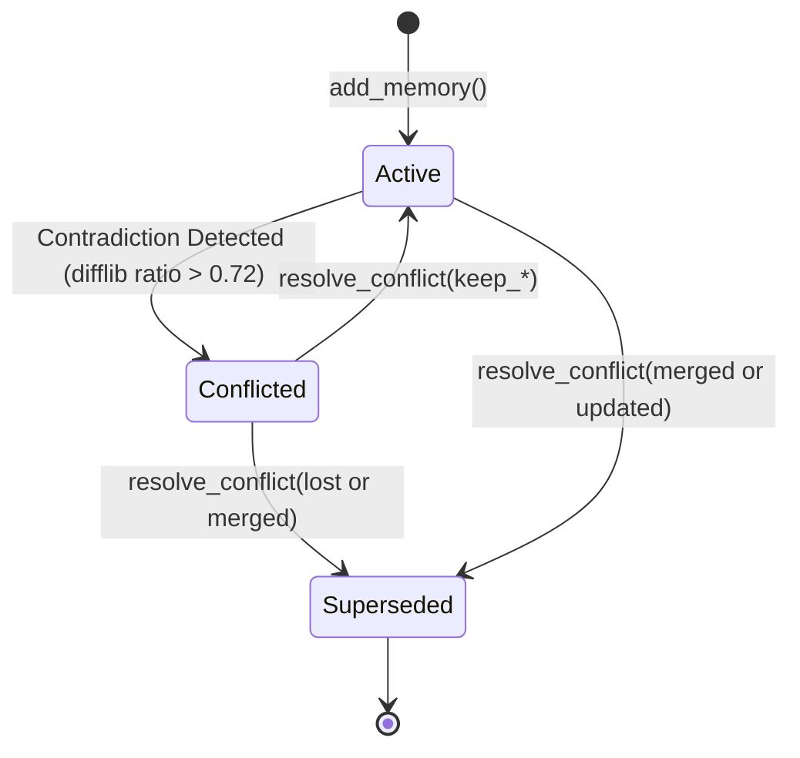

# Lifecycle of a Fact

A fact in Ghostkeep transitions through explicit states and audit stages.

---

## States Explained

### 1. `active`
- The default state when written via `add_memory`.
- Search queries retrieve active facts by default.
- Considered ground truth by agents until contradicted or superseded.

### 2. `conflicted`
- Set automatically when `_detect_conflict` identifies another active fact from a different agent asserting contradictory claims on the same topic.
- Both opposing facts remain in the store with `status: "conflicted"` and are linked in a `Conflict` record.
- Agents inspecting `list_conflicts()` can see the contradiction with both fact texts side-by-side.

### 3. `superseded`
- Set when a conflict is resolved, or when a newer fact replaces an older fact via a merge.
- The fact records `superseded_by: "<new_fact_id>"`.
- Not returned in default `search_memory` calls (unless `include_superseded=True`).
- **Never deleted** from disk or provenance logs; permanent historical context is preserved.

---

## State Transition Matrix

| Current State | Trigger | Next State | Action Taken |
|---|---|---|---|
| None | `add_memory()` | `active` | Fact saved; `created` event logged. |
| `active` | Similar fact added by other agent | `conflicted` | Conflict created in `conflicts.json`; `conflict_detected` event logged. |
| `conflicted` | `resolve_conflict(keep_a)` | `active` (A) / `superseded` (B) | Winning fact active; losing fact superseded; `resolved` events logged. |
| `conflicted` | `resolve_conflict(merge:...)` | `superseded` (A & B) | New merged fact created (`derived_from: A`); both old facts superseded. |

---

## Related Notes
- [[conflict-detection-and-resolution]] — Detailed conflict resolution logic.
- [[storage-engine]] — How state transitions are persisted.
- [[provenance-tracking]] — The immutable event ledger.
